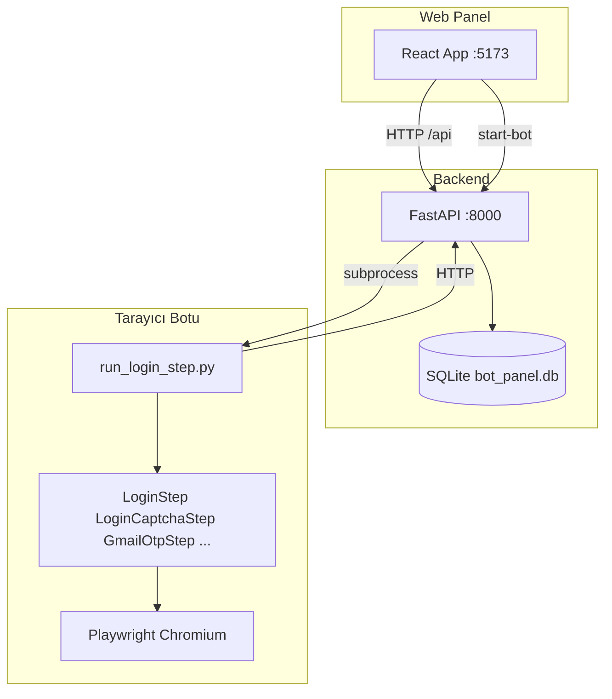

# Proje Özeti — BLS İspanya Randevu Botu ve Kontrol Paneli

Bu belge, projeyi sıfırdan anlamak veya harici bir asistanın (ör. Gemini) **tüm mimari ve iş akışına hakim olması** için yazılmıştır. Teknik detay seviyesi yüksektir; CANON kaynak olarak kodla birlikte okunmalıdır.

---

## 1. Amaç ve kapsam

**İş hedefi:** Türkiye üzerinden **BLS Spain Global** (ör. `turkey.blsspainglobal.com`) randevu / başvuru sitesinde otomasyon: tarayıcıda **Playwright** ile adım adım ilerleyerek giriş ve sonraki ekranlar (şehir seçimi, captcha vb.) otomatikleştirmek.

**Ne içerir:**

- **Python bot:** Async Playwright, **“Step-Based Page Object”** deseni: her aşama ayrı `steps/*.py`, sayfa etkileşimleri `pages/*.py`.
- **Web panel (React + Vite + TypeScript):** Hesap (profil), **müşteri** kayıtları ve **proxy havuzu**; profil düzenleme; **tek tıkla bot başlatma** (arka planda `run_login_step.py` tetiklenir).
- **Backend (FastAPI + SQLite):** Profiller, **müşteriler** (`bot_customers`), proxy atamaları, API ile bot veri kaynağı.

**Ne henüz tam kapsamlı değil (planlanan / sıradaki):** BLS **Step 2+** (şehir / randevu seçimi) ve `bot_asamalari/` ile eşleşen sonraki ekranlar; “PROXY_BLOCKED sonrası otomatik swap” gibi ileri senaryolar (rehberde anlatılmış, bot kodunda kısmen API hazırlığı var). **Giriş ekranı frekans captcha’sı** için görsel oylama tabanlı çözüm mevcuttur; yine de site kuralları ve bot koruması değişebilir.

---

## 2. Mimari görünüm

- Panel `/api` isteklerini Vite **proxy** ile `8000`’e yönlendirir (`web/vite.config.js`).
- Bot, çalışırken profil + atanmış **proxy** bilgisini **`GET /api/profiles/{id}`** veya aktif profilden alır.

---

## 3. Dizin yapısı (özet)

| Yol | Rol |
|-----|-----|
| `steps/` | İş akışı: `BaseStep`, `LoginStep`, `LoginCaptchaStep`, `GmailOtpStep`, `OtpVerificationStep` |
| `pages/` | Sayfa/lokatör: `BLSLoginPage`, `BLSLoginCaptchaPage`, `BLSOtpVerificationPage`, … |
| `utils/` | `session_config`, `bot_logging`, `playwright_proxy`, `gmail_otp`, **`captcha_visual_vote`**, **`captcha_visual_vote_playwright`**, … |
| `backend/` | `main.py`, **`customer_routes.py`**, `proxy_router.py`, `database.py`, `schemas.py`, `parse_proxy_bulk.py`, … |
| `backend/data/` | `bot_panel.db`, `bot_run.log` (panelden tetiklenen bot stdout birleşik) |
| `web/` | React + **TypeScript** (`src/App.tsx`, Vite), `web/tests/` + `playwright.config.ts` |
| `bot_asamalari/` | Kayıtlı HTML referansları (git politikası projeye göre değişebilir) |
| `tests/` | Pytest: `test_login_step_offline.py`, `test_login_captcha_step_offline.py`, `test_captcha_visual_vote.py`, … |
| `run_login_step.py` | Giriş adımını çalıştıran CLI / panel subprocess |

Kök: `requirements.txt`, `package.json` (`npm run dev:all`), `pytest.ini`, `config_manager.py`, `.env` / `.env.example`.

---

## 4. Bot aşamaları (stages) — durum tablosu

Rakamlar, referans HTML dosya isimleriyle hizalı; **uygulama durumu** kod tabanına göredir.

| Aşama (referans) | Kod / sınıf | Durum | Not |
|------------------|--------------|-------|-----|
| Ön giriş / hesap ekranı | `step0.html` → `LoginStep` + `BLSLoginPage` | **Uygulandı** | E-posta sonrası **Enter** + **5 sn** stabilizasyon (captcha tetikleme); `BLS_CAPTCHA_*` ile konteyner seçicileri; frekans captcha `solve_frequency_captcha`. Şifre alanı **15 sn** görünürlük beklemesi; anti-bot’da **clear_cookies + jitter + reload**. |
| Adım 1 LoginCaptcha (karo captcha + bölünmüş şifre) | `step1: login.html` → `LoginCaptchaStep` + `BLSLoginCaptchaPage` | **Uygulandı** | `solve_frequency_captcha` (çoğunluk karoları); güven yoksa soft reload + tek yeniden deneme. |
| OTP doğrulama ekranı (UI) | `OtpVerificationStep` + `BLSOtpVerificationPage` | **Kısmen** | Akış panel/bot entegrasyonuna göre kullanılır. |
| Gmail OTP (IMAP) | `GmailOtpStep` | **Uygulandı** | IMAP ile OTP; Playwright’tan bağımsız yardımcı adım. |
| Sonraki ekranlar (şehir, randevu) | `bot_asamalari/step*.html` | **Planlı** | Step 2+ `steps/` + `pages/` beklenir. |

**Frekans captcha (özet):** `utils/captcha_visual_vote.py` içinde `detect_dominant_group` (aHash / Hamming kümeleri). `utils/captcha_visual_vote_playwright.py` içinde **`VisualVotingStrategy`**: baskın grup yoksa **`VisualVotingUnconfidentError`** → `LoginStep`’te **ANTI_BOT_COOKIE_RETRY**; captcha sonrası Doğrulada **15 sn** poll, **CAPTCHA_VERIFY_STUCK** en fazla **2** reload. Canlıda **`BLS_CAPTCHA_MIN_DOMINANT_FRACTION`** yoksa varsayılan **0,40**. İnsansı tıklama: sıra **shuffle**, **hover + jitter**, kutular arası gecikme.

**Çalıştırma zinciri (giriş):** `run_login_step.py` → API’den profil → `LoginCredentials` → (varsa) **proxy** ile `browser.new_context` → `LoginStep.run()` → başarılı olursa `POST .../increment-run`.

---

## 5. Tasarım ilkeleri (Cursor / proje kuralları)

- **Async Playwright:** `async` / `await`; `sync_api` değil (kullanıcı kuralı).
- **Selector:** Mümkün olduğunca `data-testid`, rol ve anlamlı id; BLS sayfasında obfuscate id’ler nedeniyle görünürlük + semantik strateji kullanılıyor.
- **Step SRP:** Her step tek sorumluluk; `BaseStep`’ten türetme.
- **Loglama (zorunlu desen):** `utils/bot_logging.py` + `BaseStep.action_start` / `action_done`. Yalnızca **gerçek aksiyon** (tarayıcı, ağ I/O) başında ve sonunda log; sahte “bilgilendirme” logu yok. Satırda yerel saat ve `DURUM=basladi|tamamlandi|basarisiz` ve `adim=KOD`.
- **Kalite:** Tip ipuçları, pytest ile kritik adımlar (offline HTML).
- **Zamanlama (tarayıcı):** Bekleme için mümkün olduğunca `page.wait_for_timeout` / `wait_for_load_state` / `expect`; salt jitter veya soğuma da Playwright süresi üzerinden bağlanır (Python’da ham `time.sleep` ile sayfa bekletilmez).

`.cursor/rules/botkurallar.mdc` dosyası bazen **sync** test önerir; bu proje bot tarafında **async** seçmiştir — çelişki olursa kullanıcı kuralı ve kod tercihi önceliklidir.

---

## 6. Veri modeli (SQLite)

### `bot_profiles`

- `label`, `email`, `password` (yerel geliştirme — düz metin), `login_url`, `is_active`, `run_count`
- Silinince: ilgili `proxy_pool` atamaları sıfırlanır; aktif profil yeniden seçilebilir.

### `proxy_pool`

Rehber: `docs/PROXY_INTEGRATION_GUIDE.md` ile uyumlu alanlar:

- Bağlantı: `scheme` (`http` / `https` / `socks5`), `host`, `port`, `username`, `password`, `note`
- Atama: `assigned_profile_id`, `is_assigned`
- Operasyonel: `fail_count`, `lock_until` (ileride rate limit kilidi için rezerve)

**Toplu içe aktarma:** Satır bazlı parser (`backend/parse_proxy_bulk.py`) — `host:port`, `user:pass@host:port`, URL formatları.

**API:** `backend/proxy_router.py` — listeleme, CRUD, `bulk-import`, `rotate-assign`, `/{id}/fail`.

### `bot_customers` (veya eşdeğer müşteri tablosu)

- BLS başvuru için müşteri alanları (ad, TC, pasaport, şehir, ofis kodu, vize tipi, `live_status`, `profile_id` bağlantısı vb.); şema: `backend/schemas.py` + `database.py`.
- **API:** `backend/customer_routes.py` (`/api/customers`, `/api/customer/{id}`, …).

---

## 7. Backend API (FastAPI) — ana uçlar

| Metot | Yol | Açıklama |
|--------|-----|----------|
| GET | `/api/profiles` | Tüm profiller + join ile **proxy özeti**, `run_count` |
| GET | `/api/profiles/active` | Aktif profil (veya null) |
| GET | `/api/profiles/{id}` | Tek profil (bot bunu kullanır) |
| POST | `/api/profiles` | Yeni profil; yeni kayıt aktif yapılır |
| PUT | `/api/profiles/{id}` | Alan güncelleme |
| PUT | `/api/profiles/{id}/proxy` | `{ "proxy_id": N \| null }` atama |
| POST | `/api/profiles/{id}/activate` | Aktif profil |
| POST | `/api/profiles/{id}/start-bot` | Arka planda subprocess (`--profile-id`, `--no-wait`); tek seferde bir bot kilidi |
| POST | `/api/profiles/{id}/increment-run` | `run_count++` |
| DELETE | `/api/profiles/{id}` | Silme |
| * | `/api/customers`, `/api/customer/{id}`, … | Müşteri (BLS başvuru) CRUD; panel **Müşteriler** sekmesi (`customer_routes.py`) |
| * | `/api/proxies/*` | Proxy havuzu (`proxy_router`) |

Swagger: `http://127.0.0.1:8000/docs` (API çalışırken).

---

## 8. Ön yüz (panel)

- **Sekmeler:** Hesaplar | Proxy havuzu | **Müşteriler**.
- **Hesaplar:** Yeni profil, liste, düzenleme (modal), proxy seçimi, sil, aktif yap, **Botu başlat**.
- **Proxyler:** Toplu metin ekleme, karıştırıp hesaplara dağıt, liste, düzenle, sil.
- **Müşteriler:** Müşteri kayıtları tablosu / düzenleme; backend `bot_customers` + `customer_routes`.

---

## 9. Ortam ve çalıştırma

- **Python:** `venv`, `pip install -r requirements.txt`, Playwright Chromium kurulumu (gerekirse `playwright install chromium`).
- **Tek komut (API + panel):** kökte `npm run dev:all` (Ctrl+C ile ikisi durur). Ayrıntı: `CALISTIRMA.md`.
- **Sadece bot:** `./venv/bin/python run_login_step.py [--profile-id N] [--no-wait]`
- **API tabanı:** `backend/data/bot_panel.db`
- **Captcha / giriş (seçili ortam değişkenleri):** Örn. `BLS_CAPTCHA_CONTAINER`, `BLS_CAPTCHA_TILE_SELECTOR`, `BLS_CAPTCHA_MIN_DOMINANT_FRACTION` (varsayılan **0,40**), `BLS_SKIP_CAPTCHA`; tam liste kod / `CALISTIRMA.md`.
- **Yapılandırma:** `ConfigManager` + `.env` (Gmail OTP ve diğer anahtarlar için `.env.example` ve `docs/README_GMAIL_OTP.md`).
---

## 10. Testler

- **Python (pytest):** `pytest.ini`: `pythonpath = .`, `asyncio_mode = auto`. Offline: `test_login_step_offline.py` (`step0.html`), `test_login_captcha_step_offline.py` (`step1: login.html`; isteğe bağlı `BLS_CAPTCHA_MIN_DOMINANT_FRACTION` monkeypatch), `test_captcha_visual_vote.py`.
- **Web (Playwright TS):** `web/tests/` — `panel.spec`, `customers-panel.spec`, `bls-form-template.spec`, `offline-api.contract.spec`; `web/playwright.config.ts` (`Desktop Chrome`, yerelde varsayılan **headed**; `PLAYWRIGHT_PROXY` + `PW_HEADLESS` / `CI` ile uyum).
---

## 11. Yeni bot aşaması eklerken kontrol listesi

1. `pages/<sayfa>.py`: Lokatörler ve atomik etkileşimler.
2. `steps/<adim>.py`: `BaseStep` alt sınıfı; her gerçek işlem için `action_start` / `action_done` çifti.
3. Gerekirse `run_<akış>.py` veya mevcun koordinatöre çağrı.
4. API’de yeni alan gerekiyorsa `schemas.py` + `database.py` migrasyon.
5. `steps/__init__.py` ve bu `summary.md` tabloyu güncelle.
6. Offline / mock test mümkünse ekle.

---

## 12. İlgili belgeler (repo içi)

- `CALISTIRMA.md` — yerel çalıştırma komutları
- `docs/PROXY_INTEGRATION_GUIDE.md` — proxy–hesap ilişkisi ve operasyonel kavramlar
- `docs/README_GMAIL_OTP.md` — Gmail IMAP OTP (varsa)

---

## 13. Bilinen sınırlar / riskler

- Üretim ortamında **parola ve proxy kimlik bilgisi düz metin** saklanıyor; yalnızca güvenilir yerel geliştirme için.
- BLS arayüzü ve alan id’leri oturum bazlı değişebilir; `pages` güncellemesi gerekebilir.
- **Frekans captcha** site tarafında veya görsel kalitede başarısız olabilir; `VisualVotingUnconfidentError` ve **VERIFY_STUCK** yolları tam otomasyon garantisi vermez; gerekirse manuel veya proxy değişimi.
- Panelden başlatılan bot **headed** Chromium ister; sunucuda display / X11 yoksa uygun değildir.
---

*Belge sürümü: kod tabanıyla senkron tutulmalıdır; büyük mimari değişikliklerde bu dosya güncellenir.*
